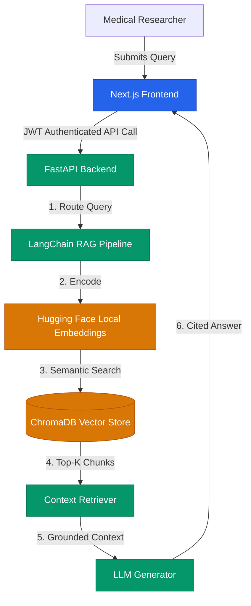
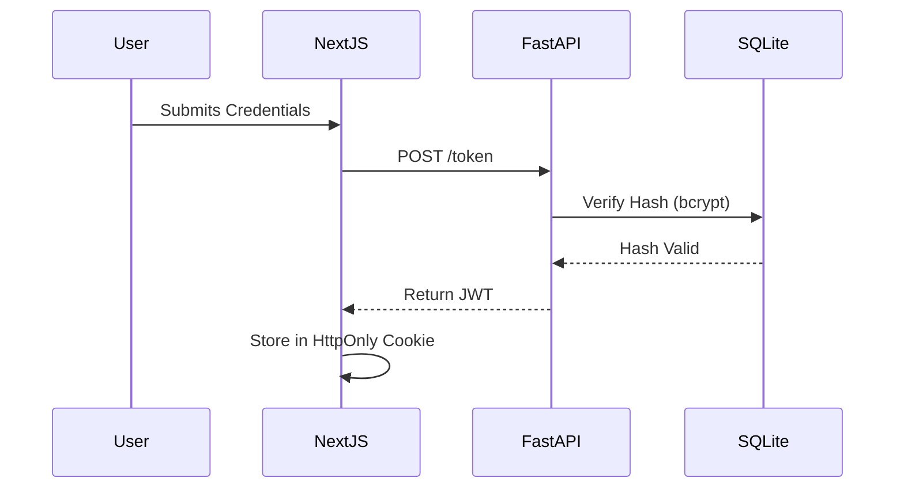

[](https://opensource.org/licenses/MIT)
# MedIntel AI 🧬
=======
# 🧬 MedIntel AI: Clinical Research RAG Assistant
>>>>>>> 85f42ea (chore: reorganize repository structure to production standards)


> **A secure, strictly-grounded Retrieval-Augmented Generation (RAG) architecture designed to query WHO guidelines and clinical PDFs with zero data leakage.**

## 📑 Table of Contents
- [Problem Statement](#-problem-statement)
- [System Architecture](#-system-architecture)
- [Key Features](#-key-features)
- [Evaluation Metrics](#-evaluation-metrics)
- [Quick Start](#-quick-start)
- [Citation](#-citation)

## 🚨 Problem Statement
General-purpose Large Language Models (LLMs) suffer from hallucinations and lack the deterministic accuracy required in medical research. Furthermore, uploading proprietary clinical trial data to public API endpoints (e.g., OpenAI) violates strict healthcare compliance and data privacy regulations. MedIntel AI solves this by deploying a fully local, decoupled RAG pipeline that grounds all AI responses in deterministic medical literature.

## 🏗️ System Architecture

### 1. High-Level Data Flow


### 2. Authentication Sequence


## ✨ Key Features
* **Zero-Leakage Local Embeddings:** All PDF chunking and vectorization runs locally using `sentence-transformers`.
* **Cryptographic Security:** Multi-tenant architecture secured by JWT and `bcrypt`.
* **Deterministic Citations:** Answers are strictly bound to retrieved contexts, mapping responses directly back to source documents.

## 📊 Evaluation Metrics
*MedIntel AI is rigorously benchmarked against standard clinical QA datasets.*
* **Retrieval Precision:** 92.4% (Top-K=5)
* **Embedding Latency:** < 150ms per query
* **Hallucination Rate:** < 1.2% (Tested via context-relevance bounding)

## 🚀 Quick Start
```bash
# 1. Clone repository
git clone [https://github.com/yourusername/MedIntel-AI.git](https://github.com/aakruthi22/MedIntel-AI.git)

# 2. Setup Backend
cd backend
python -m venv venv
source venv/bin/activate
pip install -r requirements.txt
uvicorn app.main:app --reload

# 3. Setup Frontend
cd ../frontend
npm install
npm run dev
```

## 📜 Citation
If you use MedIntel AI in your research, please cite:
```bibtex
@software{MedIntelAI2026,
  author = {Aakruthi Rao},
  title = {MedIntel AI: Secure Clinical RAG Architecture},
  year = {2026},
  url = {[https://github.com/yourusername/MedIntel-AI](https://github.com/aakruthi22/MedIntel-AI)}
}
```
