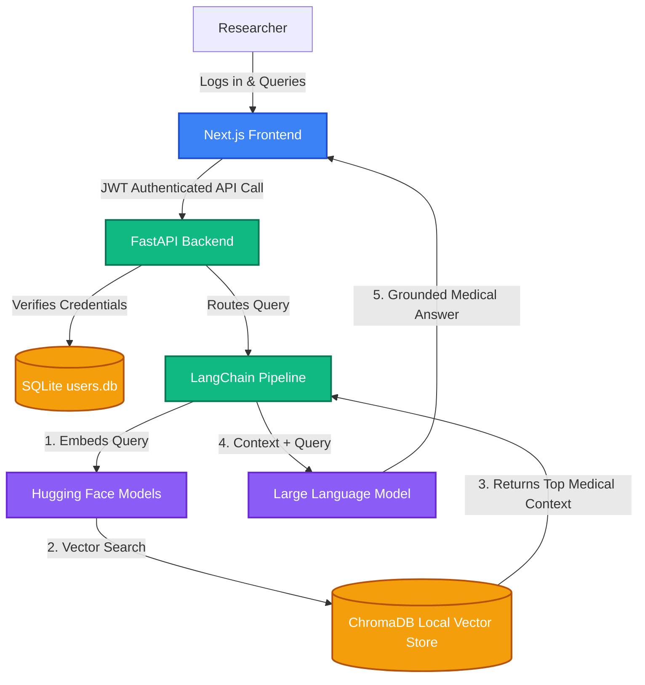

# MedIntel AI 🧬

An enterprise-grade, secure multi-agent RAG (Retrieval-Augmented Generation) platform designed for clinical medical research and document analysis. 

Built as a final-year engineering architecture project, this platform allows medical professionals to securely upload clinical trial documents and query them using locally embedded vector search, ensuring zero data leakage and high-accuracy retrieval.

### System Data Flow

## ✨ Key Features

* **Secure Multi-Tenant Authentication:** Full JWT-based login and registration system. Passwords are cryptographically hashed using `bcrypt` before reaching the SQLite database.
* **Local Vector Embeddings:** Medical PDFs are chunked and embedded locally using Hugging Face models, ensuring sensitive clinical data never leaves the server.
* **Context-Aware Retrieval:** Uses ChromaDB to perform semantic search against uploaded documents, grounding the AI's responses strictly in the provided medical texts to prevent hallucinations.
* **CORS & API Security:** Strictly configured Cross-Origin Resource Sharing middleware bridging the Next.js client and FastAPI server.

## 🛠️ Local Development Setup

To run this project locally for development or demonstration:

### 1. Clone the Repository
\`\`\`bash
git clone https://github.com/aakruthi22/MedIntel-AI.git
cd MedIntel-AI
\`\`\`

### 2. Start the FastAPI Backend
\`\`\`bash
cd backend
python -m venv venv
source venv/Scripts/activate  # On Windows
pip install -r requirements.txt
uvicorn app.main:app --reload
\`\`\`

### 3. Start the Next.js Frontend
Open a new terminal window:
\`\`\`bash
cd frontend
npm install
npm run dev
\`\`\`

Navigate to `http://localhost:3000/login` to access the secure portal.
